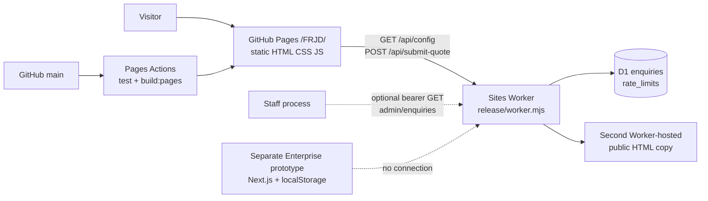

# FRJD current-state baseline — CODEX

**Inspection date:** 19 September 2026. **Canonical checkout:** `D:/Antigravity - Projects/FRJD-Corporate-V2`, `main` at `ed31c7bc61df93adc38eecca0900a72fcf1899b5`; `origin/main` resolved to the same commit. This is an extraction of the current code and read-only public responses, not a certification of business operations. No application or production code was changed for this document. Paths below are relative to this checkout unless prefixed `../FRJD-Enterprise` or `../FRJD-Rebrand`.

**Status vocabulary:** `WORKING` means implemented and locally tested or directly observed on the public host; `PARTIAL` means a real subset works but the stated user/operations workflow is incomplete; `SIMULATED` means demo or fabricated state; `DESIGNED` means an artifact/prototype exists but is not in the live execution path; `PLANNED` means intent without a connected implementation; `BROKEN` means an observed failing path; `UNKNOWN` means current evidence cannot establish the state. Status applies to the named scope, not a broad claim of production readiness.

## 1. Current runtime architecture

The public showcase is a generated static site at `https://nexverified.github.io/FRJD/` (`.github/workflows/pages.yml`, `release/build-pages.mjs`). Static HTML is generated by `createPages()` in `release/pages.mjs`; content data is in `release/content.mjs`, styling in `release/site.css`, and browser behavior in `release/client.js`. The static build inserts `<meta name="frjd-api-origin">` pointing to `https://frjd-sourcing.bhuvanraju66.chatgpt.site`, so the three enquiry forms and contact configuration call that separate Worker. The Worker is `release/worker.mjs`, bundled to `dist/server/index.js` by `release/build.mjs`, and uses the `DB` D1 binding for persistence. GitHub Pages itself has no server/database runtime. The Worker also serves a second public copy of the HTML and assets on its own origin. **Status: WORKING** for static delivery and API reachability; **PARTIAL** for the business workflow after a lead is stored. Evidence: public GETs of Pages `/`, `/quote.html`, Worker `/`, and Worker `/api/config` returned 200 on inspection; `/api/config` returned blank contact fields.

## 2. Actual application entrypoint

The customer-facing entrypoint is GitHub Pages `/FRJD/`, produced by the `main` push workflow (`.github/workflows/pages.yml` → `npm run build:pages` in `package.json` → `release/build.mjs` → `release/build-pages.mjs`). `release/build-pages.mjs` rewrites root-absolute links/assets to `/FRJD/`, sets Pages canonical metadata, copies the allowlisted images/CSS/JS, writes aliases, `.nojekyll`, and `sitemap.xml`. The backend entrypoint is the default `fetch(request, env, ctx)` export in `release/worker.mjs`, bundled by `release/build.mjs`. Local `npm run dev` is `server.js` → `release/preview.mjs` → the same Worker with local SQLite and a local asset adapter. `package.json` says `main: index.html`, but that field does not launch either deployment. The root `.html` files are build-generated/checked-in copies; GitHub Pages publishes `pages-dist`, and the Worker uses `createPages()` directly. **Status: WORKING.**

## 3. Exact production/live code paths

| Live surface | Execution path | Status |
|---|---|---|
| GitHub Pages HTML | `.github/workflows/pages.yml` → `package.json` `build:pages` → `release/build.mjs` → `release/build-pages.mjs` → `createPages()` in `release/pages.mjs` → uploaded `pages-dist/*.html` | WORKING |
| GitHub Pages CSS/JS/images | `release/build-pages.mjs` copies `release/site.css`, `release/client.js`, three tracked JPGs and generated favicon into `pages-dist` | WORKING |
| Browser interactions | `<script src="/FRJD/release/client.js" defer>` from `layout()`/Pages rewrite; quote/contact/tracking fetch Worker origin from injected meta | WORKING |
| Worker HTML/API | `release/build.mjs` bundles `release/worker.mjs` to `dist/server/index.js`; `.openai/hosting.json` names the Sites project and `DB` binding | WORKING |
| Persistent enquiry insert | Worker `submit()`/`validate()` → D1 `enquiries` and `rate_limits`; migration `drizzle/0000_overjoyed_nextwave.sql`; tested insert/confirmation and prior hosted QA | WORKING |
| Operator handling after insert | No connected alert, assignment or reply path | PARTIAL |
| Root `index.html` and other root `.html` | Rewritten by `release/build.mjs`; not the Pages artifact and not read by the Worker | DESIGNED as generated fallback/source snapshot, not an independently live router |

The current public Pages and Worker URLs responded on 19 September. The precise Worker deployment bundle hash was not exposed by those HTTP responses, so byte-for-byte equality of the currently deployed Worker and checkout is **UNKNOWN**. The last implementation session reported deploying the code at this commit; this inspection independently confirms the routes/behavior exposed by the live hosts, not the bundle identity.

## 4. Complete route/page inventory

All canonical HTML is emitted by `createPages()` in `release/pages.mjs` and published beneath `/FRJD/` on GitHub Pages. The Worker serves corresponding root paths (with `/` as home); GitHub Pages serves `/FRJD/index.html` as a file as well. All listed pages have title, description, canonical/OG metadata, shared shell, and English content. `WORKING` refers to page rendering/navigation, not whether the described commercial service is fulfilled.

| Canonical page | Purpose and current interaction | Status |
|---|---|---|
| `/` (`index.html`) | Service overview, audience, company imagery, FAQ preview; product URL GETs to `quote.html?productUrl=…` | WORKING |
| `/proxy-purchasing.html` | Sourcing/purchasing process and quote CTA | WORKING |
| `/quality-inspection.html` | Inspection scope explanation and quote CTA | WORKING |
| `/warehouse-consolidation.html` | Receiving/consolidation explanation and quote CTA | WORKING |
| `/freight-forwarding.html` | Freight/DDP explanation and quote CTA | WORKING |
| `/how-it-works.html` | Five-stage human-operated process | WORKING |
| `/quote.html` | Quote request form; creates an enquiry/reference, not a price or order | PARTIAL |
| `/pricing.html` | Cost components; no calculator or published price/rate | WORKING as explanatory page |
| `/tracking.html` | Manual shipment-update request form; no events | PARTIAL |
| `/about.html` | Company identity narrative, storefront and license-copy image | WORKING as page; identity claims need verification |
| `/contact.html` | General enquiry form and environment-supplied direct-contact links | PARTIAL because links are blank and staff routing is absent |
| `/faq.html` | Nine static answers from `release/content.mjs` | WORKING |
| `/privacy.html` | Static privacy notice | WORKING as page; legal/operational accuracy unverified |
| `/terms.html` | Static enquiry terms | WORKING as page; legal/operational accuracy unverified |
| `/restricted-items.html` | General declaration guidance | WORKING as page; route/product acceptance remains manual |
| `/404.html` | Custom not-found document; Worker returns 404; GitHub Pages fallback behavior not tested across every path | WORKING |

`aliases` in `release/pages.mjs` maps 16 old paths: `services`, `b2b-solutions`, `dropshipping`, `industries`, `taobao-sourcing-guide` → `proxy-purchasing`; `ddp-shipping`, `ddp-shipping-explained`, `routes`, `country-guides`, `customs-guide` → `freight-forwarding`; `calculator` → `pricing`; `knowledge-center` → `faq`; `warehouse-gallery`, `case-studies` → `about`; `dashboard` → `tracking`; `refund-policy` → `terms` (all `.html`). The Worker returns HTTP 301; the Pages build writes HTML/meta-refresh files for the same names, so their old content is no longer served. **Status: WORKING** as redirects; legacy functionality **PLANNED** or out of scope. The Worker alone also handles `/robots.txt` and `/sitemap.xml` (`release/worker.mjs`). Pages has `sitemap.xml` from `release/build-pages.mjs`, but `/FRJD/robots.txt` returned HTTP 404 on inspection. Pages and Worker have independent canonical/sitemap origins.

## 5. Current design system

One minified stylesheet, `release/site.css`, provides the current system. CSS variables: navy `#0a192f`, ink `#182a41`, muted `#566578`, blue `#1755b4`, paper `#f5f7f8`, line `#dce2e8`, gold `#d89b39`, max container `1200px`. Base body is 16px/1.65. Primary font stack is Inter, Segoe UI, Arial, sans-serif; Inter is not fetched or bundled, so fallback depends on the device. The home hero emphasizes text with Georgia. Spacing is explicit per component (for example `.section` 78px vertical and `.wrap` width `min(1200px, 100% - 64px)`), not a separate token scale. Shared header, footer, buttons, cards, notice blocks, forms, FAQ/details, service grid, and CTA are HTML template fragments in `release/pages.mjs` styled by CSS. Logo is styled text (`.brand`), favicon is generated by `release/build.mjs`; no icon library is in the live bundle. Three tracked photographs (`assets/warehouse_storefront.jpg`, `assets/pallet_packages.jpg`, `assets/business_license.jpg`) are copied into both public builds; image provenance is described in `about.html` copy but rights/current identity are unverified. Breakpoints at 1500, 1050, 780, and 460px; mobile nav uses `release/client.js`; `prefers-reduced-motion` disables motion. There is no current design-token package, component framework, localization, or image pipeline. **Status: WORKING** for rendered responsive layout; independent accessibility/visual regression coverage **UNKNOWN**.

## 6. Current frontend architecture

Vanilla generated HTML and shared CSS/JS, not React/Next.js. `release/pages.mjs` exports `createPages()` and `aliases`; `release/content.mjs` exports service, FAQ and step arrays. The `layout()` template injects common metadata, header/footer and deferred `release/client.js`. `form()` renders the three `.request-form` variants. Browser script handles mobile nav/details, active links, URL query prefill (`productUrl`, `service`), optional contact links from `/api/config`, form validation/submission, status/ref copy/reset. No client-side router, application store, service worker, analytics SDK, hydration, uploads or browser persistence exists (`release/client.js`). **Status: WORKING** for these bounded interactions.

## 7. Backend/API architecture

The Worker in `release/worker.mjs` is one route switch with helper functions `json`, `withPagesCors`, `publicConfig`, `digest`, `readBody`, `validate`, and `submit`. Responses are JSON with `Cache-Control: no-store`; static pages are generated in-memory with 60-second cache headers. Endpoint inventory:

| Method/path | Actual behavior | Status |
|---|---|---|
| `GET /api/config` | Validated configured contact email/WhatsApp or blank strings; allowed Pages CORS | WORKING |
| `POST /api/submit-quote` | Validates `kind=quote|contact|tracking`, contact/consent, per-field limits; D1 idempotent insert; returns `201 {success:true,request_id,status:'pending'}` or error | WORKING |
| `OPTIONS /api/submit-quote` | CORS preflight for exact `https://nexverified.github.io` origin | WORKING |
| `POST /api/resolve-product` | Constant `available:false`, `source:'manual_intake'`; does not inspect request body | WORKING as explicit unavailable response; resolver PLANNED |
| `POST /api/quote/estimate` | Constant `available:false`, `source:'manual_quote'` | WORKING as explicit unavailable response; estimate PLANNED |
| `POST /api/track` | Constant `available:false`, `source:'manual_update'` | WORKING as explicit unavailable response; live tracking PLANNED |
| `GET /api/admin/enquiries` | Requires configured bearer `FRJD_ADMIN_TOKEN`; returns newest 100 rows, parsed JSON payloads | PARTIAL; no admin UI or update workflow, live token configuration UNKNOWN |
| Other `/api/*` | 404 JSON | WORKING |
| `GET/HEAD /`, canonical HTML, aliases, selected assets, `/robots.txt`, `/sitemap.xml` | Worker-hosted second site, redirects, allowlisted assets, metadata | WORKING |

No email, job queue, webhooks, payments, orders, rate engine, supplier calls, or external product requests occur in this live Worker. **Status: PLANNED** for those capabilities. No API versioning or schema library is used; validation is hand-written.

## 8. Database architecture

The live design is D1/SQLite, **not** the adjacent Supabase schema. `db/schema.ts` and `drizzle/0000_overjoyed_nextwave.sql` define `enquiries(id PK, idempotency_key UNIQUE, payload_hash, kind, payload JSON text, created_at integer, status default pending)` with created-at index, and `rate_limits(key PK, count, expires_at)`. There are no database foreign keys or customer/order/shipment tables in this release. `submit()` stores the complete validated customer form as JSON text; it confirms a select after insert, handles duplicate idempotency keys, and increments an hourly IP-hash bucket. The local preview uses `.local/enquiries.sqlite` through `node:sqlite` in `release/preview.mjs`; hosted access uses `env.DB` (`.openai/hosting.json`). **Status: WORKING** for the schema and local insert; current live D1 binding is evidenced by the earlier hosted test reference and responding API, but row inspection in this extraction was not performed. Migration/backup/retention policies and production D1 contents are **UNKNOWN**. No RLS exists in D1; database access is controlled by the Worker/binding boundary. `expires_at` is written but there is no cleanup task in this repository.

## 9. Authentication

The published public site has no customer identity or login. Quote/contact/tracking forms are anonymous. `/api/admin/enquiries` uses a single optional bearer token, not staff accounts or roles; absent token denies all access (`release/worker.mjs`). **Status: WORKING** for denial and locally tested bearer check; full staff authentication **PLANNED**. The separate `../FRJD-Enterprise/frontend` has Supabase calls in `src/middleware.ts` and auth pages, but also accepts `frjd_session_type=simulated_customer|simulated_staff` cookies when Supabase is unavailable (`src/app/(auth)/login/page.tsx`, `src/app/app/layout.tsx`, `src/app/erp/layout.tsx`); it is **SIMULATED** and is not in the public build.

## 10. Product-link intake/resolver

The home `<form class="link-start">` GETs a URL into `/quote.html?productUrl=…`; `release/client.js` copies that query value into the quote field. `validate()` accepts a syntactically valid `http`/`https` URL with dotted hostname, no embedded credentials, up to 2048 characters. It does not identify marketplaces or fetch metadata. The form accepts a description instead of a URL; page copy explicitly says listings are manually reviewed (`release/pages.mjs`, `release/worker.mjs`). **Status: WORKING** for link preservation and manual intake; automatic resolver **PLANNED**. The untracked `api/resolve-product.js` and `js/product-resolver.js` contain older 1688/Taobao/Tmall/Alibaba/JD/Weidian/Pinduoduo detection, Yami and Jina attempts; they are not imported by `release/worker.mjs`, `release/pages.mjs` or the Pages build and are **DESIGNED** legacy code, not a live integration.

## 11. Quote/enquiry workflow

`/quote.html` gathers product URL or name, integer quantity, destination, optional postal code/target unit price, service choice, notes, name/company, email or WhatsApp, and consent (`form()` in `release/pages.mjs`). The browser creates a `crypto.randomUUID()` idempotency key, posts JSON to Worker, waits up to 20 seconds, and shows a saved `FRJD-...` reference only when the backend confirms it (`release/client.js`, `submit()` in `release/worker.mjs`). Contact and tracking forms use the same endpoint with `kind=contact` or `kind=tracking`; the latter needs a reference. The previous hosted browser QA saved a test enquiry with a reference; nine current local tests also pass. **Status: WORKING** for receiving/storing a request. There is no calculated price, supplier validation, written-quote generation, assignment, staff notification, customer message, approval, invoice, contract, order or payment in this code. End-to-end commercial quotation is **PARTIAL**; transaction completion is **PLANNED**.

## 12. Tracking

`/tracking.html` submits a `kind=tracking` enquiry with a shipment/order reference and contact details to `POST /api/submit-quote`; it is a request for a human update. `POST /api/track` always responds `available:false`. No carrier API, shipment table, tracking-number mapping, event polling/webhook, or customer-visible status timeline is in the published path. **Status: WORKING** for manual update request storage; live tracking **PLANNED**. The untracked `js/tracking-engine.js` and Enterprise shipment simulator are not connected to this site.

## 13. Customer portal

`/dashboard.html` is an alias to `/tracking.html`; there is no account, dashboard, order list or customer-specific record lookup in the published release (`release/pages.mjs`, `release/worker.mjs`). **Status: PLANNED** for the published site. `../FRJD-Enterprise/frontend/src/app/app/` contains Next.js pages for orders, procurement, warehouse, parcels, wallet and support, but many import `src/lib/simulator.ts`, which seeds `localStorage` with demo records. That separate prototype is **SIMULATED**, with no evidenced production deployment or integration with D1 enquiries.

## 14. Operations/admin functionality

Only `GET /api/admin/enquiries` can list the latest 100 enquiries when a server-side token exists; it has no pagination, filters, claim/assignment, status mutation, reply, audit log or notification (`release/worker.mjs`). Its configured availability in the current hosted environment is **UNKNOWN**; blank `.env.example` means a fresh deployment denies access. Staff workflow is **PARTIAL** at best. The separate Enterprise `/erp` pages (orders, inbound, QC, stow, pack) mutate `simulator`/`localStorage`; simulated staff cookies are accepted by its middleware/layout. They are **SIMULATED** and not part of this deployment (`../FRJD-Enterprise/frontend/src/app/erp`, `src/lib/simulator.ts`).

## 15. External integrations

| Provider/system | Current connection and evidence | Status |
|---|---|---|
| GitHub Pages/Actions | `pages.yml` checkout/test/build/upload/deploy from `main`; public Pages URL returned 200 | WORKING |
| Sites Worker + D1 | `.openai/hosting.json`, `release/build.mjs`, `release/worker.mjs`; public Worker/config returned 200; previous hosted form test saved a reference | WORKING |
| 1688, Taobao, Alibaba, other marketplaces | URLs accepted as text; no provider request in live Worker | PLANNED |
| Yami/Wenxiang | Untracked legacy `api/*` and `audits/api_docs_raw.txt` mention product/rate APIs and `YAMI_API_URL`/`YAMI_API_KEY`; not bundled or called live | DESIGNED |
| Jina Reader | Called only by untracked legacy `api/resolve-product.js`; not live | DESIGNED |
| Supabase | Separate Enterprise auth/schema and untracked legacy `api/submit-quote.js`; no call from published Worker | DESIGNED |
| Enterprise browser-local records | `../FRJD-Enterprise/frontend/src/lib/simulator.ts` seeds and mutates localStorage; not connected to D1 | SIMULATED |
| Stripe | Separate Enterprise prototype webhook/migration material; absent from published site | DESIGNED |
| Carrier tracking, email/SMS/WhatsApp delivery, analytics | No live adapter/credential/call in `release/*` | PLANNED |

Provider contracts, rights to data, credentials, and production status beyond the two observed hosts are **UNKNOWN**. No secrets are included here.

## 16. Environment variables

Live Worker names (`release/worker.mjs`, `.env.example`): `DB` D1 binding (required for writes); `ASSETS` static asset binding (needed for Worker assets); `FRJD_SITE_ORIGIN` Worker canonical/sitemap origin; `FRJD_CONTACT_EMAIL` and `FRJD_WHATSAPP_NUMBER` optional public destinations; `FRJD_ADMIN_TOKEN` optional admin bearer secret. Local/build names: `PORT` in `release/preview.mjs` (default 4173), `FRJD_SITE_ORIGIN` in `release/build.mjs` for root generated files. `release/build-pages.mjs` hardcodes the GitHub Pages origin/path and Worker API origin; it does not read deployment variables. The public `/api/config` returned empty contact values on inspection; actual host secret settings (including admin token) were not inspected. Legacy-only names `YAMI_API_URL`, `YAMI_API_KEY`, `SUPABASE_URL`, `SUPABASE_SERVICE_KEY` occur in untracked `api/*`; `NEXT_PUBLIC_SUPABASE_URL` and `NEXT_PUBLIC_SUPABASE_ANON_KEY` occur in separate Enterprise code. They are not live V1 configuration. **Status: WORKING** for current config mechanics; actual secret configuration **UNKNOWN**.

## 17. Deployment architecture

GitHub Actions on pushes to `main` (or manual dispatch) uses Node 24, `npm ci`, `npm test`, `npm run build:pages`, then GitHub Pages actions to publish `pages-dist` (`.github/workflows/pages.yml`). The latest checked-out/remote commit is `ed31c7b`. The Pages build runs `npm run build` first, which bundles the Worker and writes root HTML, then stages a static Pages artifact; only `pages-dist` is uploaded. The API host is a **separate** Sites/Worker deployment identified by `.openai/hosting.json` and built from `dist/server/index.js` plus `dist/client`/migration files (`release/build.mjs`); a GitHub push does not deploy that Worker. Public pages and backend therefore have independent release clocks and can drift. The live API origin and Pages base path are constants in `release/build-pages.mjs`; no custom domain or staging environment is in this repository. Local `.local`, `dist`, `pages-dist` are gitignored (`.gitignore`). **Status: WORKING** for observed deployment URLs; release synchronization/rollback procedures **UNKNOWN**.

## 18. Localization/i18n status

`layout()` renders `<html lang="en">`; all navigation, forms, errors and content are hardcoded English (`release/pages.mjs`, `release/client.js`, `release/content.mjs`, `release/worker.mjs`). One Chinese legal-name line appears in the footer/about content, but it is not a translated locale. No locale routes, catalog, switcher, region-specific currency/tax text, or `hreflang`. **Status: PLANNED** for multilingual support; current English delivery **WORKING**.

## 19. SEO/content architecture

`layout()` supplies unique page title, description, canonical, Open Graph/Twitter tags, one H1, and shared OG image (`release/pages.mjs`). `release/build-pages.mjs` rewrites canonical origin to Pages and writes a sitemap of canonical pages; `release/worker.mjs` generates its own sitemap and robots for the Worker origin. Pages `/FRJD/robots.txt` returned 404, while `/FRJD/sitemap.xml` returned 200. There are 15 substantive English pages, but legacy guides/country/case-study URLs are redirects rather than standalone articles. No structured data, content CMS, localization, analytics, Search Console configuration, or measured indexing is evidenced. Both Pages and Worker publicly serve similar content with different canonicals/sitemaps. **Status: PARTIAL** for SEO foundation; indexing/performance **UNKNOWN**. Static FAQs/services are maintained in `release/content.mjs`; commercial claims are not sourced to an approved business record in the code.

## 20. Tests and actual coverage

`npm test` ran on 19 September: **9 passed, 0 failed** (`tests/launch.test.mjs`). Coverage is behavior/assertion-based, not a coverage-percent report. Tests exercise 16 generated pages/metadata and 16 Worker redirects, D1-like SQLite insert/readback and idempotency, contact/tracking/WhatsApp-only requests, validation and size limits, GitHub Pages CORS/preflight, storage failure behavior, 20/hour database rate limit, private-file/admin denial and configured contact output, SEO endpoints, and manual-integration responses. `release/preview.mjs` provides local manual testing. The prior session also observed a Pages-to-Worker QA enquiry success, but this suite does **not** cover GitHub Actions execution, actual D1 admin readback, staff alerts, mailbox delivery, purchases, Yami/carriers, full browser/device/accessibility performance, or legal/business accuracy. Untracked `tests/test_live_parser.js` and `tests/verify_sourcing_pipeline.js` target legacy paths and are not run by `npm test`. **Status: WORKING** for the stated local tests; broader production verification **PARTIAL**.

## 21. Security controls

The Worker applies `nosniff`, referrer, frame/permissions and CSP headers to its own responses; JSON is no-store (`release/worker.mjs`). GitHub Pages static responses do **not** receive those application-defined Worker headers; the inspected Pages response had standard host HSTS but no app CSP. `readBody()` enforces JSON and 20 KB, `validate()` applies field types/lengths, URL protocol/credentials checks, consent and honeypot. `submit()` permits same-origin or the exact Pages origin when an Origin header exists, allows exact-origin CORS, uses SHA-256 payload hashing/idempotency, and a D1 hourly IP-derived limit. Prepared statements are used for D1. Admin listing denies by default without `FRJD_ADMIN_TOKEN`. **Status: WORKING** for these controls as locally tested. Gaps: Origin/CORS is not authentication (non-browser clients can call the public endpoint); public forms have no verified contact ownership; admin has one bearer secret and no roles/audit; PII is stored as JSON with no implemented retention/deletion UI; rate-limit rows are never purged; no published incident/backup procedure, monitoring or independent security audit is evidenced. **Status: PARTIAL** for security governance.

## 22. Current working features

| Feature | Evidence | Status |
|---|---|---|
| Public Pages home and canonical content/navigation | `release/pages.mjs`, `build-pages.mjs`; live home/quote GET 200 | WORKING |
| Responsive menu/FAQ and form query prefill | `release/client.js`, `release/site.css` | WORKING |
| Contact configuration returning blanks when unset | `publicConfig()`/`GET /api/config`; live blank response | WORKING |
| Quote/contact/tracking enquiry validation and durable local insert/reference | `validate()`, `submit()`, `tests/launch.test.mjs`; prior hosted QA reference | WORKING |
| Idempotent retries and basic request limit | `submit()`, local tests | WORKING |
| Worker redirects, sitemap/robots and explicit unavailable API responses | `worker.mjs`, tests | WORKING |
| GitHub Pages main-branch publishing | `.github/workflows/pages.yml`; live Pages URL | WORKING |

## 23. Partial features

| Feature | Missing portion | Status |
|---|---|---|
| Lead-to-human follow-up | No verified staff inbox, alert, assignment, response or SLA | PARTIAL |
| Quotation | Request storage only; no commercial calculation/quote document/approval | PARTIAL |
| Shipment updates | Request storage only; no status readback or carrier event | PARTIAL |
| Admin | Token-protected read list only; deployment config, UI, mutation and audit absent/unverified | PARTIAL |
| SEO | Metadata/sitemaps exist; duplicate public origins, missing Pages robots, indexing unmeasured | PARTIAL |
| Privacy operations | Notice exists; actual retention/access/deletion mechanism and operator process absent | PARTIAL |

## 24. Simulated features

No fabricated product prices, tracking events, quotes, customer accounts or orders are rendered by the **published** release. The adjacent `../FRJD-Enterprise/frontend` customer and ERP screens use `src/lib/simulator.ts` to seed/mutate browser `localStorage`; its fallback login accepts simulated session cookies (`src/middleware.ts`, `src/app/(auth)/login/page.tsx`). Wallet top-ups and QC photos in those screens are demo behavior. **Status: SIMULATED**, outside the current published application.

## 25. Planned/unimplemented features

Automatic marketplace parsing, supplier/SKU/variant verification, live freight calculation, Yami connection, customer-written quote approval, checkout/payment, customer account/portal, order/inventory lifecycle, live carrier tracking, staff notifications/CRM, role-based admin, data-retention tooling, multi-language pages and country-specific commercial content have no live execution path in `release/*`. Older plans/prototypes document some of these, but that does not change their current published status. **Status: PLANNED** for the public application; individual adjacent prototypes are **DESIGNED** or **SIMULATED** as described above.

## 26. Dead/orphaned/legacy files

`git ls-files` shows 59 tracked paths; the tracked release source is `release/*`, `db/schema.ts`, `drizzle/*`, workflow, three selected images, tests and generated root HTML. The checkout also has many **untracked** historical files (`git status --short`): `api/*`, `js/*`, `supabase/*`, `audits/*`, `docs/handoff/*`, extra `assets/*`, `style.css`, scripts and old plans/tests. Their presence locally does not put them in the GitHub repo or Pages/Worker deployment. `api/resolve-product.js`/`api/submit-quote.js` are older CommonJS/serverless implementations; `js/product-resolver.js`, `js/intake-ui.js`, `js/tracking-engine.js`, `components.js`, `script.js`, root `style.css`/extra images, and `../FRJD-Rebrand` are not imported by the live entrypoints. The 16 tracked root alias `.html` files are generated redirects, not preserved feature pages. `../FRJD-Enterprise` is a separate unconnected Next.js prototype. **Status: DESIGNED** for legacy code; **SIMULATED** for its Enterprise data screens. Whether any non-current environment separately uses these files is **UNKNOWN**.

## 27. Technical debt

One large template module (`release/pages.mjs`) and a single Worker route switch concentrate page/API logic. The Pages API origin and base path are hardcoded (`release/build-pages.mjs`), causing two independently deployed surfaces and potential drift. Generated root files coexist with source and old untracked code, making provenance ambiguous. D1 stores all form PII in one JSON payload without normalized operational records; there is no cleanup of `rate_limits`, notification, pagination beyond 100, status workflow, backup/retention procedure, monitoring, deployment health probe or structured logs. Static Pages cannot apply the Worker's CSP/security headers. No browser E2E/visual/accessibility/performance CI or code coverage measure exists. Duplicate public HTML origins and missing Pages robots complicate SEO. These are evidenced gaps (`release/*`, `.github/workflows/pages.yml`, `db/schema.ts`, `tests/launch.test.mjs`), not evidence of an observed outage. **Status: PARTIAL** for maintainability/operations readiness.

## 28. Contradictions with existing documentation

| Historical statement | Current code/evidence | Status |
|---|---|---|
| `docs/handoff/CODEX-FRJD-HANDOFF.md` describes owner-private Sites, no Git remote, eight tests, and hosted form verification pending (some later notes correct only part). | Public GitHub Pages and Worker both respond, `origin/main` is `ed31c7b`, nine tests pass; previous hosted QA saved a reference. | BROKEN as current-state account |
| `docs/handoff/ANTIGRAVITY-FRJD-HANDOFF.md` and plans discuss many standalone pages, richer parser/calculator/portal. | `release/pages.mjs` has 15 substantive pages + 404 and 16 aliases; live `/api/resolve-product` and `/api/quote/estimate` only return unavailable. | BROKEN if treated as deployed inventory |
| `README.md` says hosted enquiry still needs end-to-end testing. | Prior implementation session completed a Pages-to-Worker test submission; it did not establish staff notification/readback. | PARTIAL |
| `package.json` `main: index.html` can suggest a static entrypoint. | Actual publish chain is `pages.yml` → `build-pages.mjs`; backend is Worker `fetch`. | PARTIAL metadata description |
| Parent workspace `AGENTS.md` prefers Supabase/RLS for NexVerified architecture. | Published V1 uses D1 with Worker-mediated access; separate Supabase schema is not in the public execution path. | DESIGNED guideline, not current runtime |
| Old root HTML/API/JS may appear functional in checkout. | `release/build.mjs`, `release/build-pages.mjs` and Worker imports exclude old `api/`/`js/` source; root aliases replace old content. | DESIGNED legacy, not live |

## 29. Claims/data requiring business verification

The English/Chinese company identity, storefront and watermarked business-license attribution, legal right to publish images/document copy, contracting entity, registered/operating address, actual warehouse/receiving site and capacity, scope of inspection, sourcing/procurement authority, supplier and cargo acceptance, geographic service lanes, DDP/importer-of-record/tax obligations, insurance/liability, costs/margins/payment terms, quote validity, response time and privacy/retention practices need an owner-verified source before being relied upon commercially (`release/pages.mjs` about/services/privacy/terms/restricted pages; three tracked `assets/*.jpg`). The website avoids hardcoded rates and certifications, but statements that “FRJD coordinates” particular activities remain operational claims. The site currently has no verified public contact address/number (`GET /api/config` blank); customer replies and staff ownership have not been evidenced. **Status: UNKNOWN** for these business facts; do not infer them from old plans/audits or the license photograph alone.

## 30. What prevents one real customer from completing an FRJD transaction today

A customer can submit a request and receive a database-backed reference; that is **not** a transaction. The current site cannot itself validate the supplier/product, issue an approved binding quote, accept the customer's approval/payment, create an order, coordinate a documented purchase, reflect warehouse/inspection events, book shipment, or display delivery completion (`release/worker.mjs`, `db/schema.ts`, `release/pages.mjs`). More immediately, verified public contacts are blank and no operational alert/inbox/follow-up process is connected, so a real request can sit in D1 unseen. A manually operated off-site transaction could theoretically follow if FRJD staff had access and process, but that operational capacity is **UNKNOWN** from this repository. **Status: PARTIAL** for initial intake; full transaction **PLANNED**.

## A. Current architecture diagram

## B. Current customer journey

1. **WORKING:** Open Pages, read service/pricing/FAQ/terms, optionally paste a marketplace URL (`release/pages.mjs`).
2. **WORKING:** URL prefills `/quote.html`; alternatively describe a product. Complete quantity, destination, contact and consent (`release/client.js`, `form()`).
3. **WORKING:** Browser POSTs to Worker; D1 stores request; UI displays `FRJD-...` reference after confirmed save (`submit()`).
4. **PARTIAL:** Customer waits for a human response; no verified notification, SLA, account view or status lookup is connected.
5. **PLANNED:** Written quotation, approval, payment, purchase, inspection, freight and delivery occur outside this application's connected flow.

## C. Current operations journey

1. **WORKING:** Worker saves an enquiry with `status='pending'`, kind and payload (`submit()`, D1 migration).
2. **PARTIAL:** If `FRJD_ADMIN_TOKEN` is configured, an operator with the bearer token may GET the newest 100 records; no UI or per-staff identity exists (`GET /api/admin/enquiries`). Hosted token/operator setup is **UNKNOWN**.
3. **PLANNED:** Staff assignment, customer reply, supplier review, written quote, approval, order, warehouse/shipping status updates and closure have no live path.
4. **SIMULATED:** The adjacent Enterprise ERP demonstrates receiving/QC/packing in browser-local demo data; it is not fed by these enquiries.

## D. Current deployment flow

1. **WORKING:** Push tracked source to GitHub `main` → `.github/workflows/pages.yml` runs `npm ci`, nine tests, `npm run build:pages` → uploads `pages-dist` → publishes `https://nexverified.github.io/FRJD/`.
2. **WORKING, separate:** Build `release/worker.mjs` with `release/build.mjs` → deploy bundled `dist/server/index.js`, `dist/client` and D1 migration through the Sites project in `.openai/hosting.json` → Worker URL. This is **not** triggered by the GitHub Pages workflow.
3. **PARTIAL:** Static frontend embeds the Worker URL and relies on its exact-origin CORS. No atomic coordination or version pin between the two deployments is in the repository.

## E. Top 20 blockers (ranked)

`P0` = blocks reliable intake/first real commercial transaction; `P1` = material legal/security/operations gap; `P2` = product/quality scaling gap; `P3` = later growth/polish. Ranking is a recommendation, not a code change.

| Rank | Priority | Blocker and evidence | Status |
|---:|---|---|---|
| 1 | P0 | No verified owner/operator review and notification for new D1 enquiries; only optional list endpoint (`worker.mjs`). | PARTIAL |
| 2 | P0 | Live `/api/config` has blank customer email/WhatsApp; verified destinations still absent. | PARTIAL |
| 3 | P0 | No operational evidence that a real person will respond to a saved reference or meet any response target. | UNKNOWN |
| 4 | P0 | No executable quote creation/approval process; `/api/quote/estimate` always unavailable. | PLANNED |
| 5 | P0 | No order/payment/contract flow after enquiry; DB has no orders or payments. | PLANNED |
| 6 | P0 | Legal entity, commercial terms, service geography, receiving instructions and identity materials need owner verification (`pages.mjs`, assets). | UNKNOWN |
| 7 | P1 | Production staff access to `/api/admin/enquiries` and secure token custody are unverified; no staff UI/roles. | PARTIAL |
| 8 | P1 | No customer record lookup or private status view; dashboard alias redirects to tracking form. | PLANNED |
| 9 | P1 | No privacy retention/deletion implementation despite notice discussing requests; PII in JSON payload. | PARTIAL |
| 10 | P1 | Public Pages copy lacks Worker-defined CSP/frame/permissions headers; two origins have differing policy. | PARTIAL |
| 11 | P1 | Separate static/API deployments can drift; API origin hardcoded in Pages build. | PARTIAL |
| 12 | P1 | Enterprise prototype accepts simulated cookies/localStorage and cannot serve as production portal/ERP. | SIMULATED |
| 13 | P1 | No automated monitoring, alerting or recovery/backup runbook for enquiry persistence and replies. | UNKNOWN |
| 14 | P2 | Product URL intake does not resolve 1688/Taobao/Alibaba metadata, variants, availability or provenance. | PLANNED |
| 15 | P2 | No connected Yami/carrier rate, tracking or warehouse data despite legacy designs. | DESIGNED |
| 16 | P2 | D1 rate-limit records have no cleanup; admin list caps at 100 without pagination/status update. | PARTIAL |
| 17 | P2 | No live browser E2E, accessibility, load or deployment integration checks in CI beyond nine Node tests. | PARTIAL |
| 18 | P2 | GitHub Pages `robots.txt` returns 404; duplicate public site origins need canonical/indexing decision. | PARTIAL |
| 19 | P3 | Legacy guides/country/case-study URLs are redirects without current source-backed standalone content. | PLANNED |
| 20 | P3 | English-only copy and unverified image/licensing/brand typography constraints limit wider-market presentation. | PARTIAL |

**Stop point:** This document records the baseline only. No fixes, redesign, application changes or new functionality were performed.
